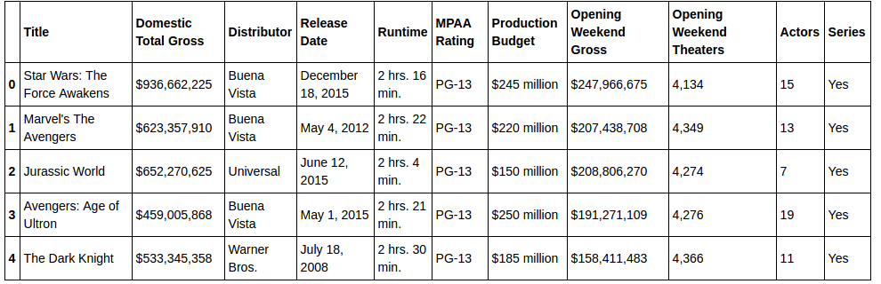
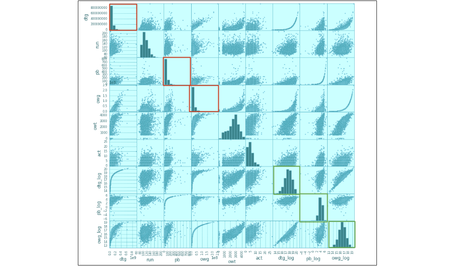
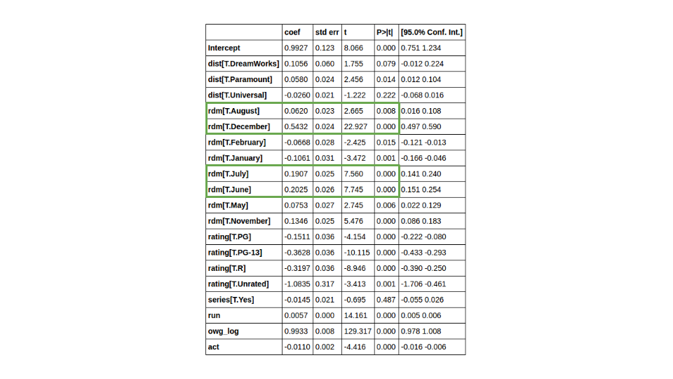
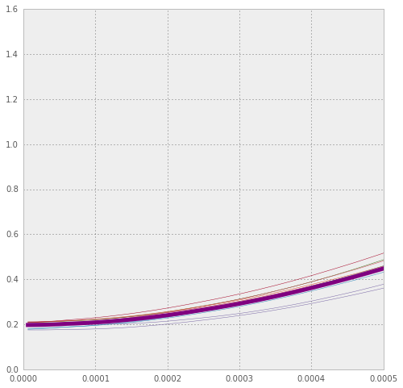
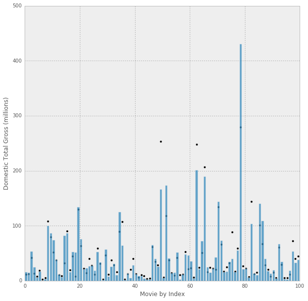

Using information scraped from the internet about the performance of over 4000 movies as well as release data we can begin to build a model to predict the domestic total gross of a given movie. Below you can find a table of the data used, showing the info for the top 5 grossing movies in the data set.

In the first model used I have tried to incorporate as much data as possible, using nearly all the entries scraped. This hindered my ability to use production budget as a predictor since many movies do not have the production budgets publicly available and instead used the opening weekend gross to predict the domestic total gross, and as can be imagined it is a very good predictor. However, first I had to transform the data as to make it better fit the normal distribution for use with linear regression. The histograms in red are how the distributions looked before the transformations with the green showing how they appeared afterward.

    

From this model we can at first glance easily recognize that the month in which the movie is released has a large effect on how it will do with regard to the domestic total gross. However, it should be noted that many studios know that these are the busiest and thereby plan to release their highest grossing movies, or what they hope to be, during that time frame. Therefore, it may not mean that releasing a movie during those months will generate high domestic total gross, rather it may just be correlated with what the studios expect to be the best months to release a blockbuster movie.
  
This information could be very beneficial if we were trying to figure out whether or not to amp up merchandising right after the release of a movie. We could use this model which utilizes opening weekend gross to predict the domestic total gross. It has an r-squared of 0.856 and fairly accurately predicts the domestic total gross. Using this we would thereby have a pretty good starting point and idea about whether or not to radically amp up production of merchandise if the movie were to become a big hit or perhaps go viral over the opening weekend. Then we could further study the exact correlation between domestic total gross and merchandise production to come up with a better idea of just how much merchandise we should produce.

Now we could use a second model, one which would try to predict the domestic total gross much earlier on before the release of the movie. This model uses the production budget as a predicting variable instead of the above opening weekend gross and yields an r-squared of only 0.395, not much better than leaving out the production budget completely, which produced an r-squared of 0.337.

Using Lasso regression I found the best alpha to be 6.104339e-06, which was the lowest tried, converging to 0 with a mean squared error of 0.205 (plotted below is mean squared error over alpha).
{: .center-image }

Below is a graph with the predictions (black dots) for domestic total gross over the actuals (bars) for the first model.
{: .center-image}

<!-- We can glean from this that one of the biggest factors is the month in which the movie is released. However, this may just be due to the fact that the biggest blockbusters all come out around the same busy months, not that a busy month would predict a blockbuster. -->

<!-- Using the production budget instead of the opening weekend gross, which would enable us to predict the domestic total gross much earlier on before the release date, yielded an r-squared of only 0.395, not much better than totally leaving out production budget, which produced an r-squared of 0.337. -->
