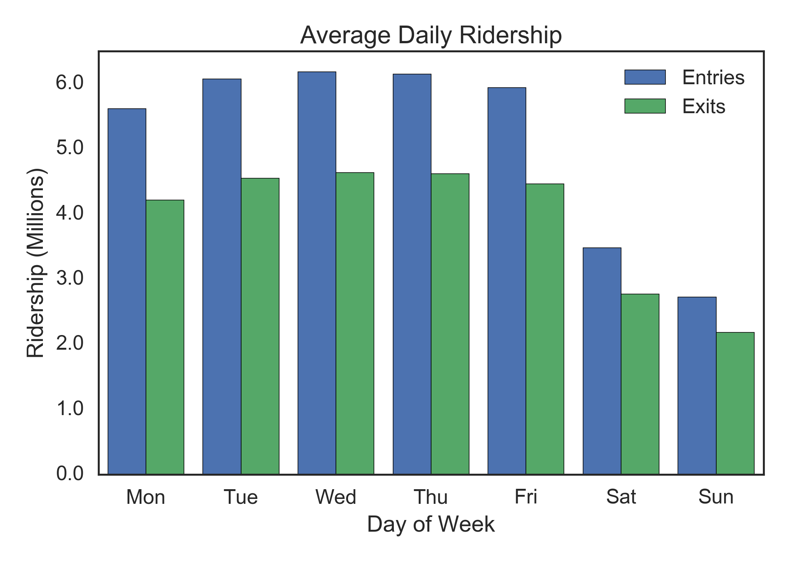
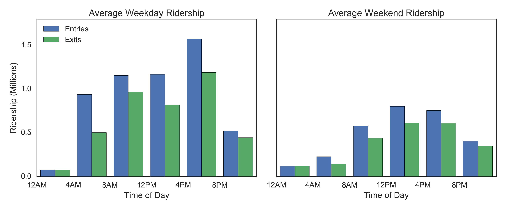
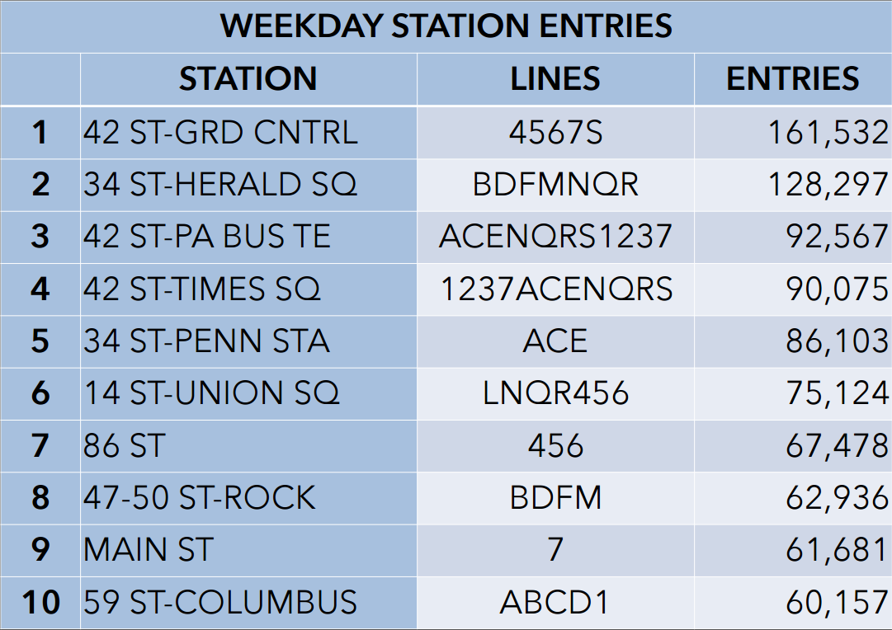

Let's start with analyzing some fascinating data about how people move about a city, and in this instance one of the largest cities in the United States. There are many things one can learn from analyzing how people move throughout a city depending on what mode of transportation is being analyzed. In this case, studying the way people move throughout the city of New York using MTA turnstile data. Using this data, one can begin to figure out where people are coming from and where they are headed. They can be coming from their place of residence and going to work, vice-versa, or maybe they are just tourists roaming around the city.

The city provides data for each turnstile within the NYC subway system on a weekly basis. It includes information on each turnstile's cumulative count for entries and exits. Sometimes there are errors in the number of counts, for instance, the numbers can be counting down instead of counting up or they can even be negative in some cases. These are just a few of the possible issues with the data that had to be dealt with before being able to do any proper analyses on it. Another issue with getting perfect data to analyze has to do with the fact that the count was only measured at 4 hour increments rather than every time someone walked through the turnstile. This makes it tougher to know whether the 8 AM to 12 PM time slot on a certain day had a lot of riders due to lots of people going to work or perhaps the people that went to work earlier (maybe around 7 AM or even earlier) and are now taking an early lunch. Though it is most likely due to the rush of people going to work, still the people going to work cannot be separated from the people going to lunch within the same time slot. These are some of the limitations to keep in mind when trying to understand the story of what is going on with the riders of the NYC subway.

One interesting thing that can be seen just from a quick glance at the data has to do with the comparison of entries to exits, even if just looking at the top stations of each (which are different). There seems to be many more entries than exits overall. This could just be because some tourists love riding the subway and can do it for days on end since they enjoy it so much, however, this is not the most likely situation. It may have to do with the fact that at some stations there are exits that are not entrance turnstiles, they tend to be in the form of full body length exits and are meant to help the flow of traffic go in a certain direction. However, this can affect the overall numbers of exits that we see. Also, it can be an effect of riders needing another exit to get out of the subway quicker, namely the exit door. This is most likely more accurate as can be seen around rush hour times. Near rush hour we tend to see a greater discrepancy between entrances and exits. There tends to be a clogging of the turnstiles and people are in a rush to get to work or home so they exit through the emergency exit door, and once one person opens the door the masses tend to follow.

There is so much more to analyze and one can keep going forever, but for brevity's sake we are going to try keeping it to only a few more ideas about this dataset. The next aspect that is of interest is the average daily ridership by day of the week.

This enables the viewer to easily grasp just how great the difference is in ridership from weekdays to weekends. It can give a bigger picture of how many people use the subway as a means of commuting to work, even though it is worth keeping in mind that some people are commuting to work on weekends as well. Another graph that helps to analyze the data and sift between the commuters and the tourists or other people roaming the city is the breakdown of ridership by time of day, both for weekdays and weekends.

From this the viewer can hope to discern a better picture of who is riding the subway and where they may be going, yet it is still far from complete especially without the next vital piece of information, the subway stations.

Below are the lists for the top stations by number of entries, one for the top stations during the week and the other for the top stations over the weekend. This differs, as you'd imagine, since tourist destinations, such as Herald Square with the Manhattan Mall and Times Square with the Disney store, would be more popular over the weekend than during the week when many more people are working and commuter stations have more traffic.
 

  

There are many more things to look at and one can go on forever so just one more interesting thing to note from this data is that during the week there are nearly 100,000 more riders entering at the top station than at the top station on the weekend. This can mean many different things or maybe nothing much at all, that's the beauty of data.  
