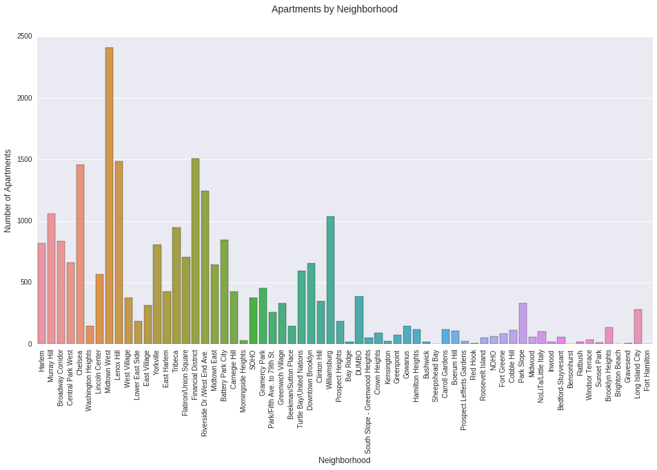
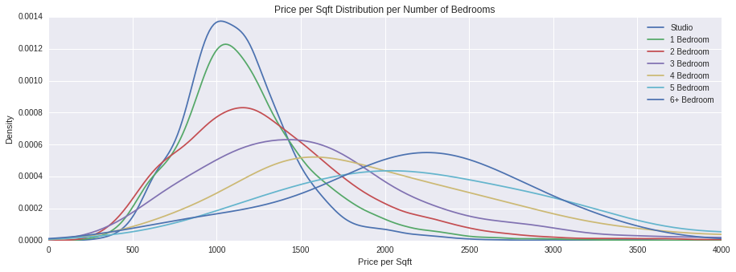
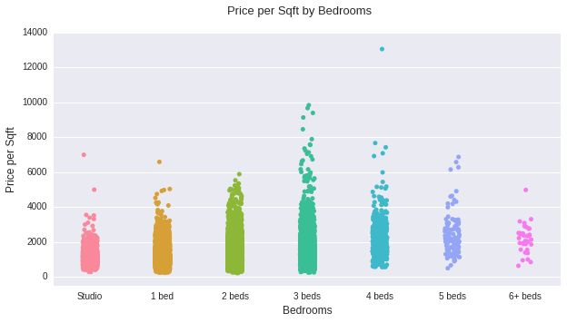
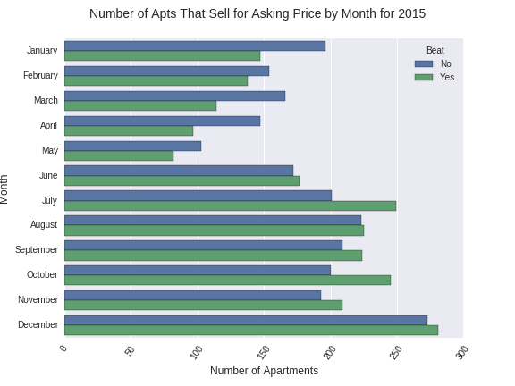
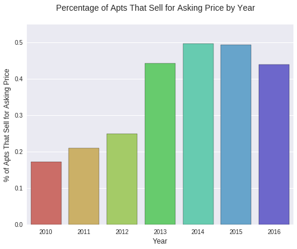

We've all been there, on the search for the best, whether it be for a certain product or maybe even a job or partner. The search can be endless leading from one thing to the next, tirelessly gathering data and trying to make the best decision. There's a quote from Steve Jobs,  

  "If you haven’t found it yet, keep looking. Don’t settle. As with all matters of the heart, you’ll know when you find it."{: .center-text}  

The search that I am referring to here is the search for a place to live, more specifically, an apartment in New York City. This can be a very daunting task, there are just so many options. To start, one can look into one neighborhood and then decide if they like that neighborhood or not, then they can move their search to another neighborhood. Then based on one's income and preferences he or she can decide on how many bedrooms to look for, or number of required bathrooms, square footage, etc. the options are endless.

I would like to help you with this daunting task and make it that much easier for you by giving you the ability to easily compare ranges across neighborhoods and type of apartments as well as giving you the upper hand when it comes to negotiating prices when you finally find the perfect place that you want and get it back into that perfect price range too. Hopefully, if you incorporate the information below you can make the best offer while keeping within your budget. The model that I built predicts the sale price based on a number of factors and classifies whether or not the apartment in question will beat the list price by selling for an equal or higher value than the list price or miss it by selling for less. Below you will be able to find a link to a model that you will be able to try out yourself and see what it would predict for your search.

So let's take a look at the data. I analyzed over 24,000 apartments throughout New York City, mostly in Manhattan and Brooklyn. The data is over the course of approximately 5 years, starting in 2011 and going through 2016. The most expensive apartment sold was for $88,000,000, yes that's really eighty-eight and six zeros, which was located in 15 Central Park West.

{: .center-image}

  Figure 1. Number of Apartments by Neighborhood

We can then look at the distribution of price per square foot for apartments based on how many bedrooms are in the apartment.

{: .center-image}

  Figure 2. Distribution of Price Per Square Foot by Bedrooms

Based on the figure above we can see that studios and 1 bedrooms have a narrower range for price per sqaure foot, at least when comparing it to 2, 3, or 4 bedroom apartments which have a much greater variance and standard deviation. In figure 3 we can also see the variance of price per square foot for 3 bedrooms is greater than that of even 4 bedroom apartments.

{: .center-image}

  Figure 3. Price Per Square Foot by Bedrooms

It is good to also keep in mind the times that certain months to seem to have a trend for having apartments that sell for equal or higher than list price. As can be seen in figure 4 for the year of 2015, July and October seem to be the best months to sell an apartment in order to beat out the asking price, while January through May do not seem to do as well and most apartments tend to sell for below list price.

{: .center-image}

  Figure 4. Apartments That Beat Asking Price by Month for 2015

It is also very interesting to note the trend across years. For the few years after the market crash people were still learning to trust the market and were most likely weary of paying too much for an apartment, in this case even paying list price. However, as time went on things started to pick up and the trust in the market starting to go up creating higher demand, thereby leading people to invest even more to get the apartment they want.

{: .center-image}

  Figure 5. Percentage of Apartments That Beat Asking Price by Year

The only thing now to be weary of is how the cycle seems to be turning, which could have some interesting implications for the future.

Please feel free to check out my CartoDB map below and play around with my model [here](http://stark-chamber-51964.herokuapp.com).  

<iframe id='my_map' width="100%" height="520" frameborder="0" src="https://asgrunwald.carto.com/viz/4df7beb6-59ae-11e6-aa90-0e05a8b3e3d7/embed_map"
        allowfullscreen webkitallowfullscreen mozallowfullscreen oallowfullscreen msallowfullscreen>
</iframe>

  1. Tireless Search
  2. Inspiration from Jobs
  3. Searching for an apt in NYC can be a daunting task
  4. Having information about what price to bid plays a very big role in getting the best offer possible and keeping one within their budget.
  5. At the end of the post there is a link to a page where you can try it one of the models and see what it would predict for your search.
  6. Let's take a look at the data.
  7. Talk Numbers
  8. Plots of Counts and Distributions
  9. Exploratory Plots of Neighborhoods
  10. How months match up for selling at or above asking price.
  11. Trend across past few years and where it is headed.
  12. Take a look at my map on CartoDB with the data points of apts used for this model.

